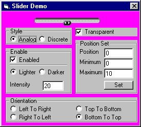



## Active Slider

### Description

As a lot of people asked, I added orientation property.

This is a horizontal/vertical slider ActiveX. You can drag the pointer from minimum to maximum positions with your mouse. Or you can click on any visible part of slider to set pointer at this position. Or you can set position programatically. Includes PositionChanged Event. Control can be transparent or opaque. Now you can control the appearance of disabled image. You can configure your slider in the way you like it most.

Source codes, readme and demo project included.

Enjoy!!!
 
### More Info
 

             |
---                |---
**Submitted On**   |2001-07-03 16:01:20
**By**             |[Gene Martynov](https://github.com/Planet-Source-Code/PSCIndex/blob/master/ByAuthor/gene-martynov.md)
**Level**          |Intermediate
**User Rating**    |4.8 (53 globes from 11 users)
**Compatibility**  |VB 4\.0 \(32\-bit\), VB 5\.0, VB 6\.0
**Category**       |[OLE/ COM/ DCOM/ Active\-X](https://github.com/Planet-Source-Code/PSCIndex/blob/master/ByCategory/ole-com-dcom-active-x__1-29.md)
**World**          |[Visual Basic](https://github.com/Planet-Source-Code/PSCIndex/blob/master/ByWorld/visual-basic.md)
**Archive File**   |[Active Sli22168732001\.zip](https://github.com/Planet-Source-Code/gene-martynov-active-slider__1-12249/archive/master.zip)

